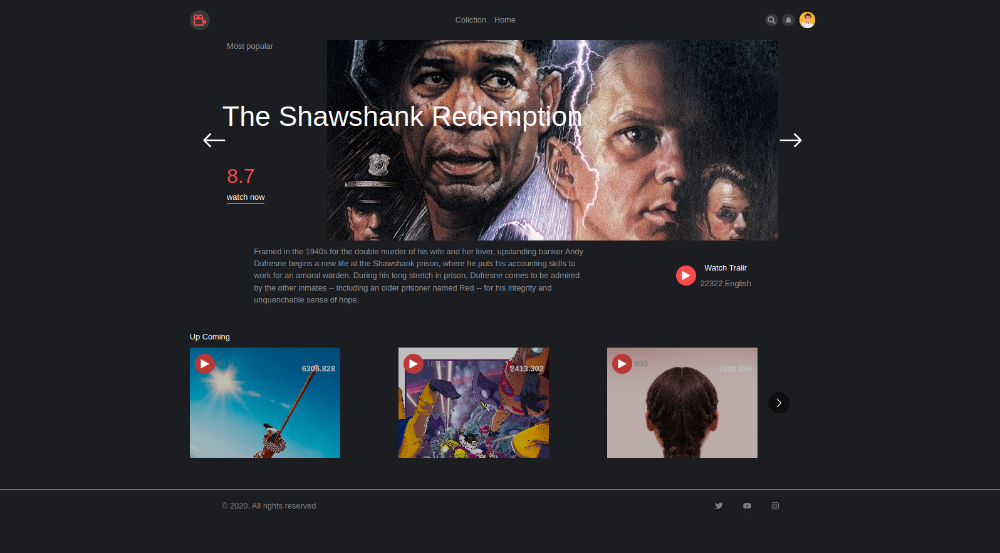

# Movie_app

This project was bootstrapped with [Create React App](https://github.com/facebook/create-react-app).

## Your-Cinema
A web-based application to help see top-rated, upcoming movies with a lot of features like seeing the movie cast, trial, and similar movies Environment: [Reactjs,ChakraUi,Redux,themoviedb’sApi I designed and implemented user-friendly pages as well as fetching and stored real data from themoviedb API

## Available Scripts

In the project directory, you can run:

### `npm start`

Runs the app in the development mode. 
Open [http://localhost:3000](http://localhost:3000) to view it in the browser.

The page will reload if you make edits. 
You will also see any lint errors in the console.

[Live link](https://your-cinema.netlify.app/)

